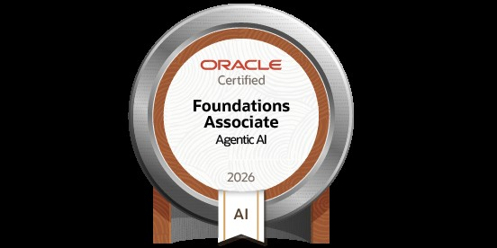

  

💻 Full Stack Developer | AI & Cyber Security Enthusiast | DSA Learner

 

<h2 align="left">🏆 Certifications</h2>

<table border="0" cellspacing="0" cellpadding="10">
<tr>

<td align="center" width="50%" valign="top" style="border:none;">

  

<b>Oracle Agentic AI Certified Foundations Associate</b>

 

Oracle University

 

Issued: July 2026

</td>

<td align="center" width="50%" valign="top" style="border:none;">

  

<b>Ultimate AWS Certified Cloud Practitioner CLF-C02 2026</b>

 

Udemy

 

Completed: July 2026

</td>

</tr>
</table>

  

  

  

